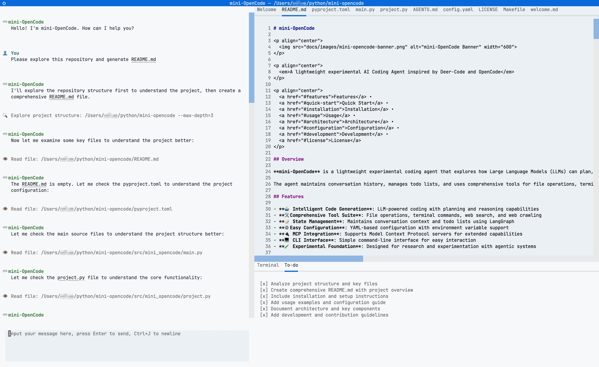
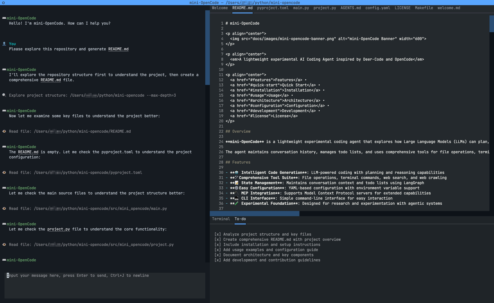

<div align="center">

# mini-OpenCode

[](https://opensource.org/licenses/MIT)
[](https://www.python.org/downloads/)
[](https://google.github.io/styleguide/pyguide.html)

[English](./README.md)

**mini-OpenCode** 是一个轻量级、实验性的 AI 编程智能体，灵感源自 [Deer-Code](https://github.com/MagicCube/deer-code) 和 [OpenCode](https://github.com/anomalyco/opencode)。它展示了大语言模型（LLM）如何在极简的基础设施下进行规划、推理并迭代编写代码。本项目基于 [LangGraph](https://github.com/langchain-ai/langgraph) 构建，旨在为理解和构建智能体编程系统提供一个可扩展的基础。

<br/>


<br/>

</div>

---

## ✨ 特性

- **🤖 智能编程智能体**：利用 LangGraph 实现有状态的多步推理与执行。
- **📝 上下文感知任务管理**：内置 TODO 系统，用于跟踪复杂多步任务的进度。
- **🛠️ 完善的工具集**：包含文件操作（`read`, `write`, `edit`）、文件系统导航（`ls`, `tree`, `grep`）、终端命令（`bash`）、网络搜索（`tavily`）以及网页爬取（`firecrawl`）。
- **🔌 可扩展架构**：支持 [Model Context Protocol (MCP)](https://modelcontextprotocol.io/)，可轻松集成外部工具和服务器。
- **🚀 智能体技能系统**：动态加载特定的指令、脚本和资源（Skills），以提升在特定任务（如前端设计）上的表现。
- **🎨 交互式 UI**：使用 [Textual](https://github.com/Textualize/textual) 构建的整洁终端界面，支持深浅色模式自动切换及模型响应流式输出。
- **⚡️ 斜杠命令**：通过 `/clear`（重置聊天）、`/resume`（恢复会话）和 `/exit`（退出）等命令快速访问功能，支持自动补全建议。
- **⚙️ 高度可配置**：灵活的 YAML 配置文件，支持自定义模型参数、工具及 API 密钥。
- **🔒 类型安全**：全量类型提示（Python 3.12+），确保代码可靠性及开发体验。
- **⚡ 性能优化**：内置文件缓存（LRU 策略）和智能大文件流式处理。
- **📋 代码模板**：智能模板系统，提供代码生成器用于快速搭建项目（FastAPI CRUD、Python API、React 组件）。
- **🧪 测试框架**：集成 pytest，为核心模块提供全面的单元测试。
- **📊 结构化日志**：使用 structlog 实现高级日志记录，便于调试和监控。

## 📖 目录

- [特性](#-特性)
- [环境准备](#-环境准备)
- [安装指南](#-安装指南)
- [配置说明](#-配置说明)
- [使用方法](#-使用方法)
- [项目结构](#-项目结构)
- [开发指南](#-开发指南)
- [参与贡献](#-参与贡献)
- [致谢](#-致谢)
- [开源协议](#-开源协议)

## 🚀 环境准备

- **Python 3.12** 或更高版本
- **[uv](https://github.com/astral-sh/uv)** 包管理器（强烈推荐用于依赖管理）
- LLM API 密钥（如 DeepSeek, Doubao）及可选的网络工具密钥（Tavily, Firecrawl）

## 📦 安装指南

1.  **克隆仓库**
    ```bash
    git clone https://github.com/your-username/mini-opencode.git
    cd mini-opencode
    ```

2.  **安装依赖**
    ```bash
    uv sync
    # 或者使用 make
    make install
    ```

## ⚙️ 配置说明

1.  **环境变量**
    复制示例环境文件并填入你的 API 密钥：
    ```bash
    cp .example.env .env
    ```
    编辑 `.env`：
    ```ini
    DEEPSEEK_API_KEY=your_key_here
    # 可选：
    ARK_API_KEY=your_doubao_key
    KIMI_API_KEY=your_kimi_key
    TAVILY_API_KEY=your_tavily_key
    FIRECRAWL_API_KEY=your_firecrawl_key
    ```

2.  **应用配置**
    复制示例配置文件：
    ```bash
    cp config.example.yaml config.yaml
    ```
    编辑 `config.yaml` 以自定义启用的工具、模型参数和 MCP 服务器。

3.  **LangGraph 配置（可选）**
    如果你打算使用 LangGraph Studio 调试智能体，请复制示例 LangGraph 配置文件：
    ```bash
    cp langgraph.example.json langgraph.json
    ```

## 💻 使用方法

### CLI 模式
在目标项目目录上直接运行智能体：
```bash
uv run -m mini_opencode /absolute/path/to/target/project
# 或者使用 python
python -m mini_opencode /absolute/path/to/target/project
```

### 开发模式 (LangGraph Studio)
启动 LangGraph 开发服务器以可视化并与智能体交互：
```bash
make dev
```
然后在浏览器中打开 [https://smith.langchain.com/studio/?baseUrl=http://127.0.0.1:2024](https://smith.langchain.com/studio/?baseUrl=http://127.0.0.1:2024)。

## 🏗️ 项目结构

```text
mini-opencode/
├── src/mini_opencode/
│   ├── agents/           # 核心智能体逻辑与状态定义
│   ├── cli/              # 终端 UI (Textual) 组件
│   ├── config/           # 配置加载与校验
│   ├── models/           # LLM 模型工厂与设置
│   ├── prompts/          # 提示词模板 (Jinja2)
│   ├── skills/           # 技能系统实现（加载器、解析器、类型）
│   ├── tools/            # 工具实现
│   │   ├── file/         # 文件 I/O (read, write, edit)，支持缓存和流式处理
│   │   ├── fs/           # 文件系统 (ls, tree, grep)
│   │   ├── terminal/     # Bash 执行
│   │   ├── web/          # 搜索与爬取
│   │   ├── mcp/          # MCP 工具集成
│   │   ├── todo/         # 任务管理
│   │   └── template/     # 代码模板生成器（FastAPI CRUD 等）
│   ├── cache/            # 文件和工具缓存，支持 LRU 策略
│   ├── logging_config.py # 结构化日志配置
│   ├── main.py           # CLI 入口
│   └── project.py        # 项目上下文管理器
├── skills/               # 智能体技能（指令、脚本及参考资料）
├── tests/                # 单元测试 (pytest)
│   └── unit/             # 核心模块单元测试
├── AGENTS.md             # 智能体开发指南
├── Makefile              # 构建与运行命令
├── config.example.yaml   # 示例配置模板
├── langgraph.example.json# 示例 LangGraph 配置模板
└── pyproject.toml        # 项目依赖与元数据
```

## 🔧 开发指南

### 添加新工具
1.  在 `src/mini_opencode/tools/` 中创建一个新文件。
2.  使用 `@tool` 装饰器并设置 `parse_docstring=True`。
3.  添加 Google 风格的 docstrings 以进行参数解析。
4.  在 `src/mini_opencode/agents/coding_agent.py` 中注册该工具。

### 代码风格
- **类型提示**：所有函数必须包含类型提示。
- **Docstrings**：要求使用 Google 风格。
- **命名规范**：函数/变量使用 `snake_case`，类名使用 `PascalCase`。

详见 [AGENTS.md](AGENTS.md) 获取详细的开发准则。

## 🤝 参与贡献

欢迎贡献！请随时提交 Pull Request。

1.  Fork 本项目
2.  创建特性分支 (`git checkout -b feature/AmazingFeature`)
3.  提交更改（遵循 [Semantic Commits](https://www.conventionalcommits.org/) 规范，例如 `git commit -m 'feat: Add some AmazingFeature'`)
4.  推送到分支 (`git push origin feature/AmazingFeature`)
5.  开启一个 Pull Request

## 🙏 致谢

特别感谢以下项目的开发者，为本项目提供了灵感和架构参考：

- **[Deer-Code](https://github.com/MagicCube/deer-code)**
- **[OpenCode](https://github.com/anomalyco/opencode)**

## 📄 开源协议

本项目采用 MIT 协议开源 - 详见 [LICENSE](LICENSE) 文件。

---
*Built with ❤️ using [LangGraph](https://langchain-ai.github.io/langgraph/) and [Textual](https://textual.textualize.io/).*
